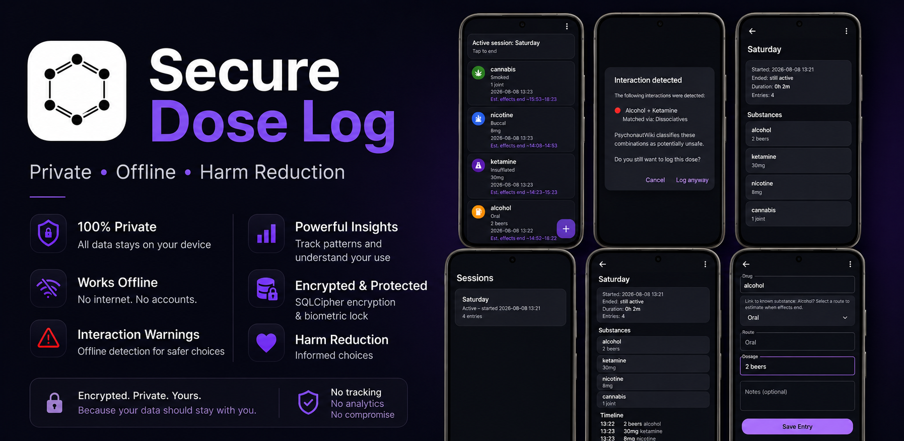

<p align="center">
  
</p>

# Secure Dose Log

> **A private, offline harm reduction journal for logging substance use and medication administration on Android.**

Turboautism Dose Log is a free and open-source Android application designed to help users maintain an accurate record of substance or medication use.

Every record is stored locally on the device. The application has **no accounts, analytics, advertising, cloud services, or network communication**.

The project is built around three principles:

- **Privacy first** — your data belongs to you.
- **Offline by default** — everything works without an internet connection.
- **Harm reduction** — provide information, never judgement.

---

## Why this project exists

People may find it difficult to remember exactly:

- what they took,
- how much they took,
- when they took it,
- or what combinations they used.

This can become particularly difficult during longer sessions or when multiple substances are involved.

Keeping an accurate log can help users make more informed decisions and may also provide valuable information to healthcare professionals if medical treatment becomes necessary.

Turboautism Dose Log is designed to make that process simple while keeping sensitive information private.

The application does not encourage or promote drug use. It recognizes that some people will use psychoactive substances regardless and aims to reduce harm by helping them maintain accurate records.

---

## ✨ Features

### Dose logging

- Drug or medication name
- Route of administration
- Dosage
- Automatic timestamp
- Optional notes
- Edit existing entries
- Swipe-to-delete with undo

### Sessions

Related doses can be grouped into sessions, for example:

- Friday night
- Festival
- Medication adjustment
- Recovery

Session features include:

- Multiple active sessions
- Automatic dose assignment
- Manual session selection when several sessions are active
- Session timeline
- Session duration
- Substance summary
- Session statistics

### Harm reduction

Turboautism Dose Log includes an entirely offline interaction detection system.

Before a new dose is logged, the application can compare it against substances in the active session that are estimated to still be active and warn about combinations classified by PsychonautWiki as:

- 🔴 **Dangerous**
- 🟠 **Unsafe**
- 🟡 **Uncertain**

Interaction detection:

- Works completely offline
- Uses a bundled reference database generated from PsychonautWiki
- Matches interactions using substance and classification information
- Uses route-specific duration data to estimate whether previously logged substances may still be active
- Never prevents a dose from being logged
- Always allows the user to continue after seeing a warning

Interaction detection is intentionally conservative. Reference classifications and automated matching can produce false positives or otherwise require interpretation.

Warnings are advisory only and should not be considered medical advice.

### Statistics

Built-in statistics include:

- Total entries
- Entries today
- Entries during the last 7 days
- Most frequently logged substance
- Average doses per day
- Last recorded dose

---

## 🔒 Privacy & Security

Privacy is a core design goal of Turboautism Dose Log.

The application:

- Never communicates over the internet
- Does not request Android's network permission
- Does not include analytics or tracking
- Does not include advertising
- Does not require an account
- Stores all user data locally
- Encrypts the local database using SQLCipher
- Uses the Android Keystore to protect encryption material
- Requires biometric authentication or device credentials
- Prevents screenshots and screen recording
- Hides application contents from the recent-apps preview
- Disables copy/cut in text fields to reduce clipboard exposure

The application has **no runtime dependency on external servers or services**.

Once installed, it can operate entirely offline.

---

## 📤 Data import and export

Turboautism Dose Log supports:

- CSV export
- CSV import
- Duplicate detection
- Partial import failure reporting

CSV exports are intentionally plaintext.

This allows records to be readily shared with emergency medical services, physicians, detoxification clinics, or other healthcare providers when necessary.

Because exported CSV files are not encrypted by the application, users should consider where those files are stored or shared.

---

## 📚 Offline reference database

Turboautism Dose Log contains a bundled substance reference database derived from data provided by **PsychonautWiki**.

The database includes information such as:

- Substance names
- Aliases
- Routes of administration
- Duration information
- Chemical classes
- Psychoactive classes
- Interaction classifications

The database is generated during development using the PsychonautWiki GraphQL API and tooling contained in this repository.

The resulting data is bundled into the APK as:

```text
app/src/main/assets/substances.json
```

The Android application itself does **not** contact PsychonautWiki or download reference data at runtime.

Database updates are distributed as part of application releases.

For information about regenerating the database, see:

```text
tools/README.md
```

---

## 📱 Compatibility

Minimum supported Android version:

**Android 11 (API 30)**

The application has been tested on Android 11 and Android 16.

---

## 📦 Download

Prebuilt APKs are available from the project's **GitHub Releases** page.

Download the latest `.apk` release and install it manually on your Android device.

---

## 🛠️ Building from source

### Requirements

- Android Studio
- Java 17+
- Android SDK
- Git

Clone the repository:

```bash
git clone https://github.com/emmikal/Secure-dose-log.git
```

Open the project in Android Studio and build normally.

### Regenerating the substance database

Additional tooling is provided for regenerating the bundled PsychonautWiki reference database.

See:

```text
tools/README.md
```

for setup and usage instructions.

---

## 📜 Licensing

Turboautism Dose Log contains software developed specifically for this project as well as reference data derived from PsychonautWiki.

These components are licensed separately.

### Application and project source code

Unless otherwise noted, the source code developed for Turboautism Dose Log is licensed under the:

**GNU General Public License v2.0 (GPL-2.0)**

See the repository's `LICENSE` file for the full license text.

### PsychonautWiki reference data

The bundled `substances.json` database contains data derived from **PsychonautWiki**.

PsychonautWiki data is licensed under:

**Creative Commons Attribution-ShareAlike 4.0 International (CC BY-SA 4.0)**

The generated attribution information is included in:

```text
app/src/main/assets/substances_ATTRIBUTION.txt
```

The GPL-2.0 license covering the application source code does not replace the license applicable to the PsychonautWiki-derived reference data. That data remains subject to its original CC BY-SA 4.0 terms.

Turboautism Dose Log is an independent project and is **not affiliated with or endorsed by PsychonautWiki**.

---

## ❤️ Supporting development

Turboautism Dose Log is free and open-source software developed on a volunteer basis.

If you find the project useful and would like to support continued development, you can sponsor the project through GitHub Sponsors.

Support helps cover things such as:

- Development tools
- Google Play developer fees
- Maintenance of the bundled PsychonautWiki reference database
- Testing devices
- Ongoing development and maintenance

Thank you for helping keep the project free, private, and open source.

---

## 🙏 Acknowledgements

Turboautism Dose Log builds upon the work of many excellent open-source projects and communities.

See [`ACKNOWLEDGEMENTS.md`](ACKNOWLEDGEMENTS.md) for full credits and acknowledgements.

Special thanks to the PsychonautWiki community for making its reference information available under an open license.

---

## ⚠️ Disclaimer

Turboautism Dose Log is a **harm reduction tool**.

It does not encourage, promote, or endorse drug use.

The application and its bundled reference information are provided for informational and personal record-keeping purposes only.

Interaction warnings are generated automatically from reference data and may be incomplete, inaccurate, or produce false positives.

**Turboautism Dose Log is not a medical device and is not a substitute for professional medical advice, diagnosis, or treatment.**

In a medical emergency, seek appropriate emergency medical assistance.

---

## 💬 Contributing and feedback

Contributions, bug reports, feature requests, discussion, and pull requests are welcome.

If you encounter a problem or have an idea for improving Turboautism Dose Log, please open an issue in the GitHub repository.
